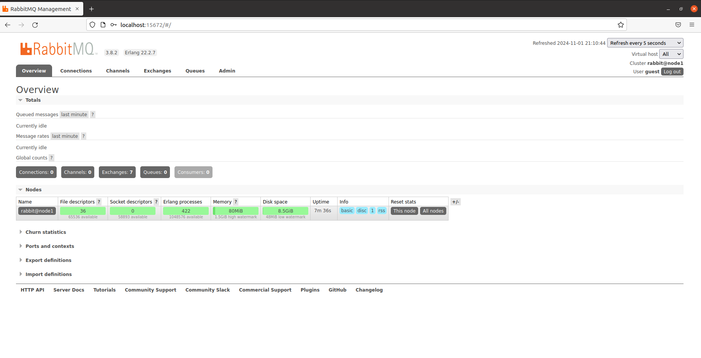
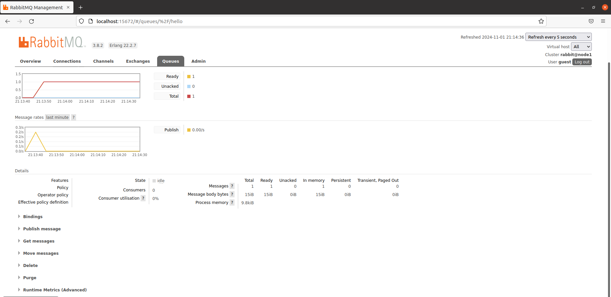
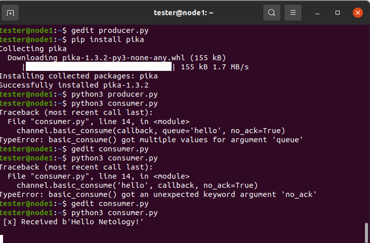
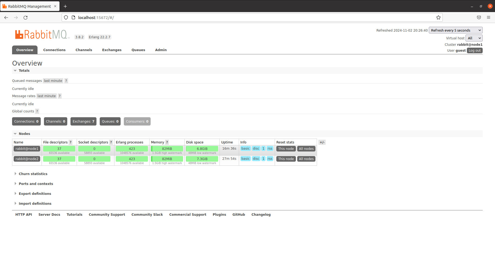
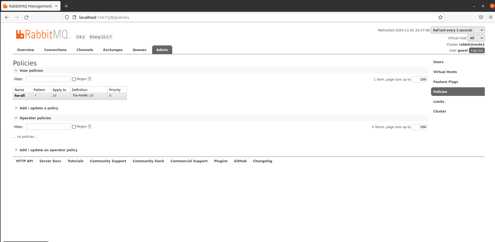
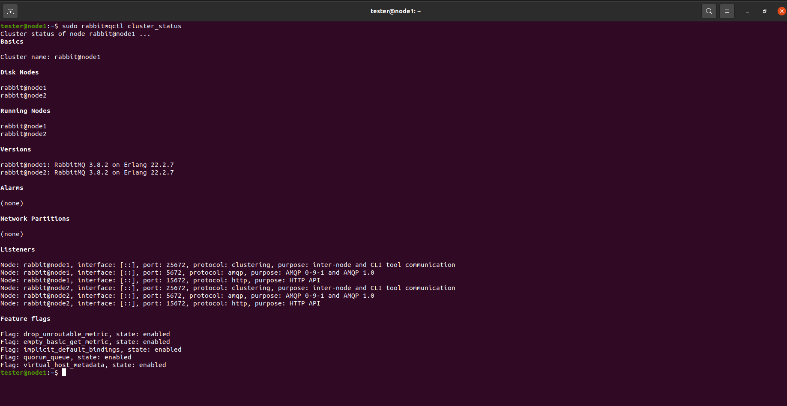
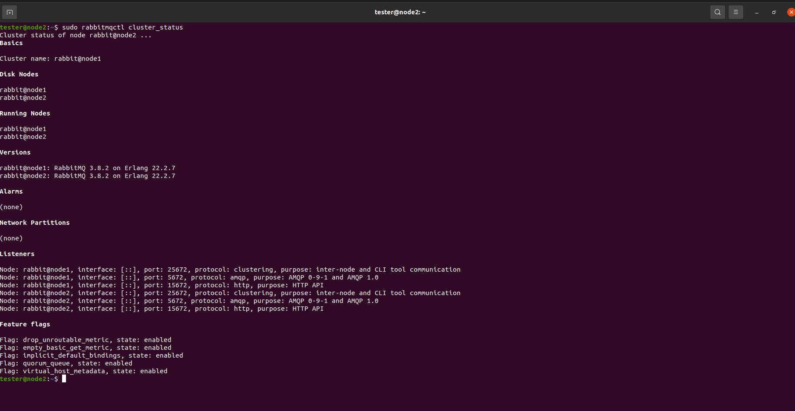
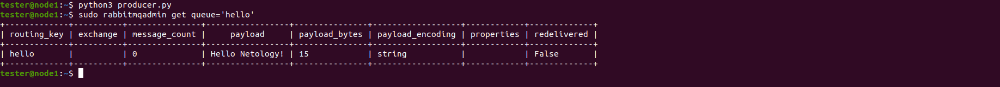
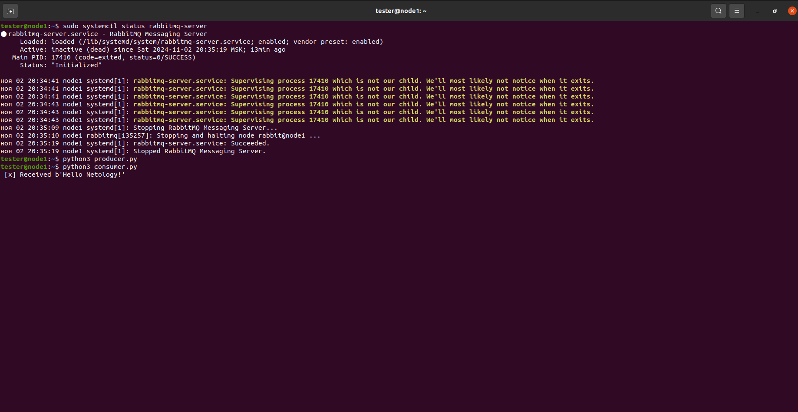

# Домашнее задание к занятию "`Очереди RabbitMQ`" - `Виталий Коряко`

https://github.com/netology-code/sdb-homeworks/blob/main/11-04.md 

### Задание 1. Установка RabbitMQ

Используя Vagrant или VirtualBox, создайте виртуальную машину и установите RabbitMQ.
Добавьте management plug-in и зайдите в веб-интерфейс.

*Итогом выполнения домашнего задания будет приложенный скриншот веб-интерфейса RabbitMQ.*

### Решение 1

```
sudo apt install rabbitmq-server
rabbitmq-plugins enable rabbitmq_management
http://localhost:15672/#/
# default guest/guest
```



### Задание 2. Отправка и получение сообщений

Используя приложенные скрипты, проведите тестовую отправку и получение сообщения.
Для отправки сообщений необходимо запустить скрипт producer.py.

Для работы скриптов вам необходимо установить Python версии 3 и библиотеку Pika.
Также в скриптах нужно указать IP-адрес машины, на которой запущен RabbitMQ, заменив localhost на нужный IP.

```shell script
$ pip install pika
```

Зайдите в веб-интерфейс, найдите очередь под названием hello и сделайте скриншот.
После чего запустите второй скрипт consumer.py и сделайте скриншот результата выполнения скрипта

*В качестве решения домашнего задания приложите оба скриншота, сделанных на этапе выполнения.*

Для закрепления материала можете попробовать модифицировать скрипты, чтобы поменять название очереди и отправляемое сообщение.

### Решение 2

```
sudo apt install python3 python3-pip
pip install pika
```





### Задание 3. Подготовка HA кластера

Используя Vagrant или VirtualBox, создайте вторую виртуальную машину и установите RabbitMQ.
Добавьте в файл hosts название и IP-адрес каждой машины, чтобы машины могли видеть друг друга по имени.

Пример содержимого hosts файла:
```shell script
$ cat /etc/hosts
192.168.0.10 rmq01
192.168.0.11 rmq02
```
После этого ваши машины могут пинговаться по имени.

Затем объедините две машины в кластер и создайте политику ha-all на все очереди.

*В качестве решения домашнего задания приложите скриншоты из веб-интерфейса с информацией о доступных нодах в кластере и включённой политикой.*

Также приложите вывод команды с двух нод:

```shell script
$ rabbitmqctl cluster_status
```

Для закрепления материала снова запустите скрипт producer.py и приложите скриншот выполнения команды на каждой из нод:

```shell script
$ rabbitmqadmin get queue='hello'
```

После чего попробуйте отключить одну из нод, желательно ту, к которой подключались из скрипта, затем поправьте параметры подключения в скрипте consumer.py на вторую ноду и запустите его.

*Приложите скриншот результата работы второго скрипта.*

### Решение 3

```
https://habr.com/ru/articles/193332/
https://www.rabbitmq.com/docs/clustering

На второй машине устанавливаем и настраиваем rabbitmq и python3 аналогично действиям в заданиях 1-2

Чтобы объединить ноду RabbitMQ в кластер с другими нодами, нужно убедиться, что у всех нод одинаковый Erlang cookie.
Этот cookie используется для аутентификации и шифрования связи между нодами кластера RabbitMQ.

Создать ~/.erlang.cookie на node1 и node2 и сделать его одинаковым по наполнению, например, с помощью openssl rand -hex 20

Далее назначаем права
chmod 400 ~/.erlang.cookie
chown rabbitmq:rabbitmq ~/.erlang.cookie

Перезапускаем server на всех нодах
sudo systemctl restart rabbitmq-server

На node2
sudo rabbitmqctl stop_app
sudo rabbitmqctl join_cluster rabbit@node1
sudo rabbitmqctl start_app

Убеждаемся, что кластер создан
sudo rabbitmqctl cluster_status

Создаём политику ha-all на все очереди
rabbitmqctl set_policy ha-all ".*" '{"ha-mode":"all"}'

# ha-all — имя политики. Можно задать как угодно
# ".*" — регулярное выражение для фильтрации имен очередей. В данном случае .* указывает, что политика применяется ко всем очередям.
# '{"ha-mode":"all"}' — параметры политики. Параметр ha-mode: all указывает, что все очереди будут реплицированы на все ноды кластера.

Проверить политики
sudo rabbitmqctl list_policies

Добавим варик подключаться через guest/guets не только с локал хост
sudo gedit /etc/rabbitmq/rabbitmq.conf
loopback_users = none
sudo systemctl restart rabbitmq-server

Отключаем ноду1 и проверяем работу кластера
tester@node1:~$ sudo sudo rabbitmqctl stop_app
tester@node1:~$ sudo systemctl stop rabbitmq-server
tester@node1:~$ python3 producer.py 
tester@node1:~$ python3 consumer.py 
 [x] Received b'Hello Netology!'


```














## Дополнительные задания (со звёздочкой*)
Эти задания дополнительные, то есть не обязательные к выполнению, и никак не повлияют на получение вами зачёта по этому домашнему заданию. Вы можете их выполнить, если хотите глубже шире разобраться в материале.

### * Задание 4. Ansible playbook

Напишите плейбук, который будет производить установку RabbitMQ на любое количество нод и объединять их в кластер.
При этом будет автоматически создавать политику ha-all.

*Готовый плейбук разместите в своём репозитории.*
